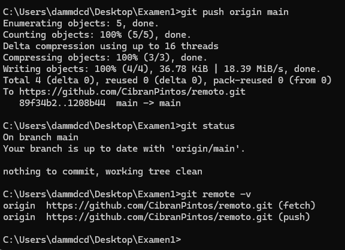

#Tarea Examen

#Instrucciones

- Para este apartado se pueden utilizar apuntes propios y consultar información en Internet.

- Utilizando Git realiza las siguientes acciones:

- Crea un repositorio remoto en tu cuenta de GitHub, GitLab, etc.
"Descarga" dicho repositorio a la máquina local.
Crea un fichero "README.md".
- Añade el fichero al repositorio local.
- Realiza cambios en el fichero README.md y ve incluyéndolos en distintos commits.
- Sincroniza el repositorio local con el remoto.
Salva una captura de pantalla mostrando el resultado del comando "git status" para el repositorio local. Incluye un fichero de texto plano con la dirección del repositorio remoto.

#Captura de pantalla del git status
